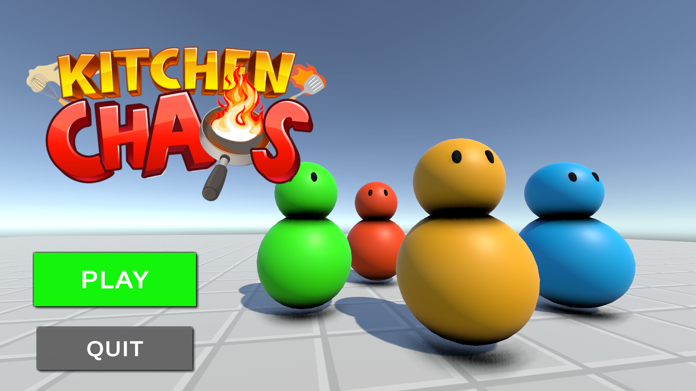
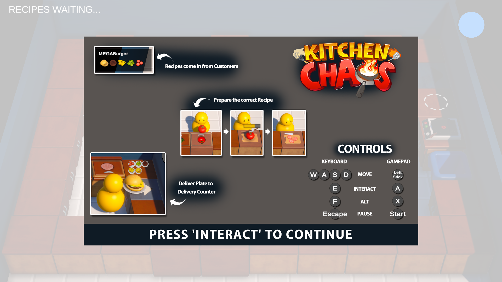
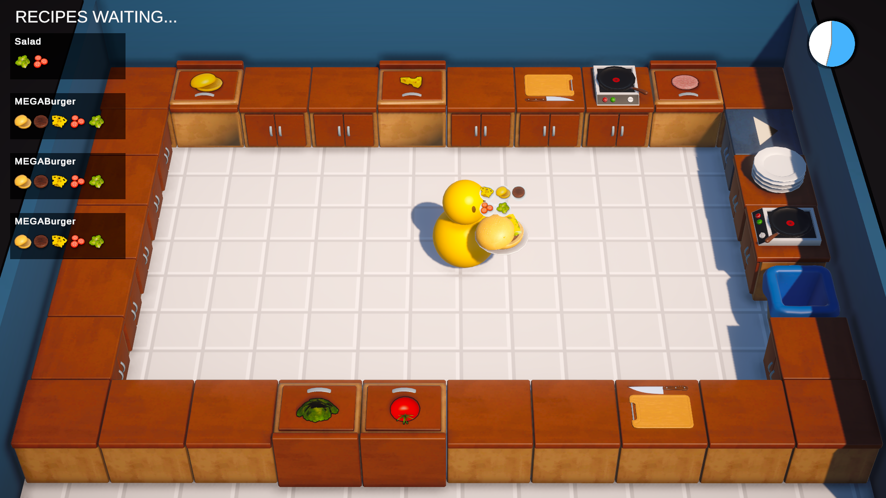
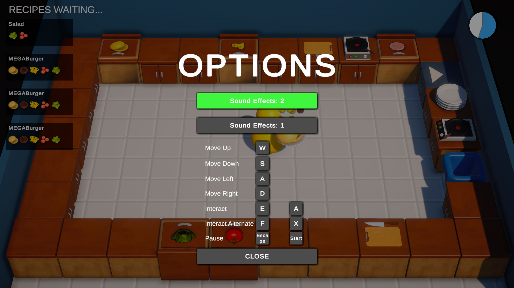
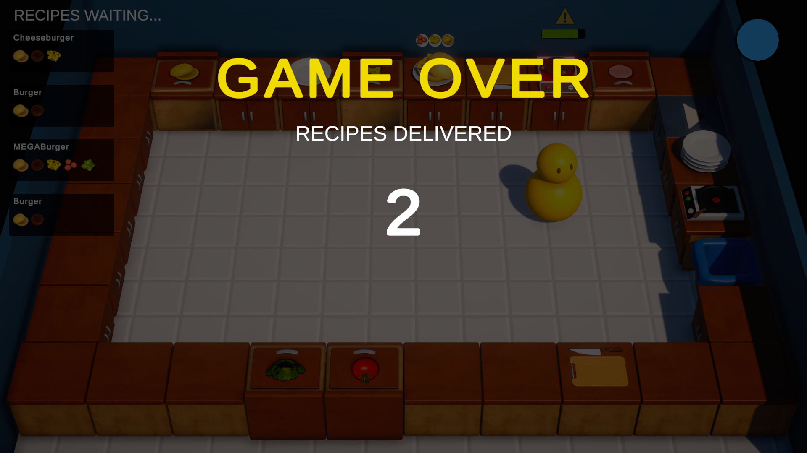

# Kitchen Chaos - Overcooked Clone


**ABOUT THE PROJECT:** This project is based on Code Monkey's step-by-step tutorial on how to create a complete game with clean coding and good programming practices. You can find it [here.](https://www.youtube.com/watch?v=AmGSEH7QcDg) 
I built the entire game with a multiplayer aspect using Netcode for game objects. However, I later realized that the source code became too cluttered with the multiplayer logic, which requires a completely different architecture.

Therefore, I am sharing this version of the game separately because I am more familiar with the syntax and the way it is put together. The multiplayer project is available at this [link](https://github.com/OzgenKoklu/KitchenChaosNetcode), and the step-by-step process of creating the single-player version can be observed in the commit history. [This commit](https://github.com/OzgenKoklu/KitchenChaosNetcode/tree/a0367b347c1759463f828c40cf42f67ca7136407) is the main source of this repository, and I have also added descriptions to those commits if you are interested.

**Disclaimer:** All assets were borrowed from Code Monkey and are not intended for commercial use. This is a learning project, and I've built it independently under instructions from Code Monkey. 

**ABOUT THE GAME:** This is a small-scale casual game heavily inspired by Overcooked, where the objective is to deliver specific orders within a time limit. It is a complete package, featuring scene cycles, sound and animation, an options menu, saveable settings, and customizable key bindings.

---
**TL;DR:** In short, what I've learned from this project:

**1.** Properly utilize intermediate C# features and concepts: Events, Scriptable Objects, Interfaces, Inheritance, Delegates, Callbacks, Enums.

**2.** Implement Observer and State Machine design patterns effectively.

**3.** Embrace refactoring; architecture doesn't have to be perfect from the start, adapt as needed.

**4.** Use methods in a versatile way, explore out parameters, and employ methods with various return types.

**5.** Decoupling the logic, visuals, sounds, UI, and everything using classes that are eqipped with strong methods and events.

---
# Images

Main Menu



Tutorial UI



Gameplay 



Settings UI



Gameover




# GIFs

Game Start Flow


Delivery Success


# Youtube Video

Entire game loop can be viewed in this youtube video:

[](https://youtu.be/92pFdvhzqCg)

---

**Regarding my background and the significance of this course material:** 

In 2022, I embarked on my journey as a game developer. The initial months were dedicated to familiarizing myself with the Unity Editor and learning about its various components. I completed Unity's official Jr pathway, gaining a basic understanding of game development. Subsequently, I created my first complete project during a boot camp, and you can find the repository [here](https://github.com/OzgenKoklu/Bootcamp_Project_UnityNo1).

While working on this project, I realized that despite my knowledge of individual components, constructing an architecture for a functional game is far more challenging than anticipated. At that time, I lacked knowledge about events or delegates, resorting to using public boolean flags extensively to control game mechanics. Managing 20 different bools to alter game states seemed inefficient. What about employing state machine design patterns or the Observer pattern to decouple the logic? I was merely crawling through the process.

I became obsessed with 'best practices' and was paralyzed by my perfectionism for a couple of months. I attempted to learn more advanced topics, but the advice I received emphasized creating more prototypes. Unfortunately, the available tutorials were fragmented, offering 10-minute out-of-context guides on scriptable objects, interfaces, events, delegates, or design patterns, which did not contribute to a comprehensive understanding.

In search of cohesive learning materials, I explored source codes of complete projects, gaining better insights into these complex topics. Then, I came across this project. Following a 10-hour course, I believe I made significant progress in my coding skills. Witnessing a senior developer build systems from scratch, contrary to my initial assumptions about the process, was eye-opening. Code Monkey consistently refactored the code as needed, which greatly contributed to my learning experience.

---

# More about what's covered in this project for those with more time:

The project is a course project by Code Monkey, and it's curriculum can be found [here.](https://unitycodemonkey.com/kitchenchaoscourse.php) However, I want to revisit my own commits and create my own list of what I've learned:

# **What I've learned:** 

Concepts, techniques and game development patterns used in this project:

**1.** Global volume - Postprocessing effect 

**2.** Player Input - old & new input system, InputActions, ReadValue, Interact.Performed

**3.** Movement & positioning - Transform, Lerp, Slerp, vector normalization, .localposition

**Code Snippet 1:** Getting a normalized vector from the new input system, from /Assets/Scripts/GameInput.cs

```csharp
public Vector2 GetMovementVectorNormalized()
    {
       Vector2 inputVector = playerInputActions.Player.Move.ReadValue<Vector2>();
       inputVector = inputVector.normalized;
       return inputVector;
    }
```

**4.** Player Animation - Seperating Logic and visuals, animator usage (setbool, settriger)

For separating logic and visuals, there are several other examples in this project, such as PlatesCounter.cs and PlatesCounterVisual.cs.

**5.** Raycast / Capsulecast - LayerMask - out RayCastHit 

**Code Snippet 2:** Raycast example from Assets/Scripts/Player.cs, the counter object ahead of the player will be selected using this logic.

```csharp
 private void HandleInteractions()
    {
        Vector2 inputVector = gameInput.GetMovementVectorNormalized();

        Vector3 moveDir = new Vector3(inputVector.x, 0f, inputVector.y);

        if (moveDir != Vector3.zero)
        {
            lastInteractionDir = moveDir;
        }

        float interactDistance = 2f;
        if (Physics.Raycast(transform.position, lastInteractionDir, out RaycastHit raycastHit, interactDistance, countersLayerMask))
        {
            if (raycastHit.transform.TryGetComponent(out BaseCounter baseCounter))
            {
                //has clearcounter
                if (baseCounter != selectedCounter)
                {
                    SetSelectedCounter(baseCounter);
                }
            }
            else
            {
                SetSelectedCounter(null);
            }
        } else
        {
            SetSelectedCounter(null);
        }
    }
```

**6.** Prefabs - Prefab variants: All counters in this project are derived from base counter

**7.** Events - How to subscribe/unsubscribe and trigger events. Events with extended arguments.

SoundManager.cs extensively relies on events and can be considered an 'observer' pattern.

**Code Snippet 3:** from Assets/Scripts/Player.cs, invoking an event with extra args via ("?.Invoke") syntax that provides a null check. 

```csharp
public event EventHandler<OnSelectedCounterChangedEventArgs> OnSelectedCounterChanged;
public class OnSelectedCounterChangedEventArgs : EventArgs { public BaseCounter selectedCounter; };

private void SetSelectedCounter(BaseCounter selectedCounter)
    {
        this.selectedCounter = selectedCounter;


        OnSelectedCounterChanged?.Invoke(this, new OnSelectedCounterChangedEventArgs
        {
            selectedCounter = selectedCounter
        });
    }
```

**Code Snippet 4:** from Assets/Scripts/SelectedCounterVisual.cs, subscribers side, if the selectedCounter is the subsriber, it will show itself.

```csharp
private void Start()
    {
        Player.Instance.OnSelectedCounterChanged += Player_OnSelectedCounterChanged;
    }
	
private void Player_OnSelectedCounterChanged(object sender, Player.OnSelectedCounterChangedEventArgs e)
    {
       if(e.selectedCounter == baseCounter)
        {
            Show();
        }
        else
        {
            Hide();
        }
    }	
```

**8.** Generics <T> implementation - EventHandler<T>

**9.** Simple way to implement a Singleton Instance

**Code Snippet 5:** from Assets/Scripts/Player.cs, writing public getter and private setter in one line for one line singleton implementation.

```csharp
public static Player Instance  { get; private set;  }
```

**10.** Scriptable Objects - data holders, data can anything: A list of audio files, list of other scriptable objects, list of prefabs, or data related to an asset, its prefab, string name, sprite icon etc. 

**Code Snippet 6:** Different Scriptable object examples in this directory: Assets/Scripts/ScriptableObjects/

```csharp
//Data related with a significant kitchen object is held in the scriptable object for ease of access within scripts. 
//CreateAssetMenu attribute provides right-click>create >scriptableObject option for Unity Editor.
[CreateAssetMenu()]
public class KitchenObjectSO : ScriptableObject
{
    public Transform prefab;
    public Sprite sprite;
    public string objectName;
}

//audioclips were stored in this scriptable object to be used by sound manager script. 
//This approach is ideal because if a new audio is added to the list,
//just updating the SO would update it for every other script that uses it. 
[CreateAssetMenu()]
public class AudioClipRefsSO : ScriptableObject
{
    public AudioClip[] chop;
    public AudioClip[] deliveryFail;
    public AudioClip[] deliverySuccess;
    public AudioClip[] footstep;
    public AudioClip[] objectDrop;
    public AudioClip[] objectPickup;
    public AudioClip stoveSizzle;
    public AudioClip[] trash;
    public AudioClip[] warning;
}

// frying recipe was for stove counter where we used it to access and load to the fried objects prefab after frying is done
[CreateAssetMenu()]
public class FryingRecipeSO : ScriptableObject
{

    public KitchenObjectSO input;
    public KitchenObjectSO output;
    public float fryingTimerMax;

}
```

**11.** Interfaces - Including guidelines on how to be something, anything! Like a Kitchen Object Parent(?), or to Have Progress to show.

**Code Snippet 6:** Different Interface examples in this code base from Assets/Scripts/

```csharp
//Every kitchen object parent should have these functions, they can have their own implementations but they need these
public interface IKitchenObjectParent
{
    public Transform GetKitchenObjectFollowTransform();

    public void SetKitchenObject(KitchenObject kitchenObject);

    public KitchenObject GetKitchenObject();

    public void ClearKitchenObject();
    public bool HasKitchenObject();
}
//Anyhing that uses a UI image progress bar and display progress adapt this interface, this interface just holds an event and its EventArgs
public interface IHasProgress 
{
    public event EventHandler<OnProgressChangedEventArgs> OnProgressChanged;
    public class OnProgressChangedEventArgs : EventArgs
    {
        public float progressNormalized;
    }
}
```

**Note:** You can't use [SerializeField] for Objects that have specific interface, but you can [SerializeField] the GameObject and use .GetComponent<T>() to reach the Interface.

**12.** Stronger methods with many different return types and out parameter: 

As a beginner, I often used 'void' methods, primarily employing them to modify variables. This approach led to spaghetti logic and code that lacked cleanliness. 
In my opinion, this tendency is influenced by the way these concepts are typically presented in beginner tutorials.

We have utilized numerous methods in this project that return various types such as Bool, Transform, and Class. While it's not possible to showcase all of them in a snippet, I want to illustrate the structure of this code.

Additionally, multiple versions of the PlaySound() method, differing in their argument counts, have been implemented in SoundManager.cs.

**Code Snippet 7:**  HasKitchenObject() returns a bool, GetKitchenObject returns the KitchenObject of interest, and we execute even more logic from there onward all thanks to great methods with all sorts of return types.

```csharp
    public class DeliveryCounter : BaseCounter
	{
	//...
    public override void Interact(Player player)
    {
	if (player.HasKitchenObject())
    {
            if (player.GetKitchenObject().TryGetPlate(out PlateKitchenObject plateKitchenObject))
                //only accepts plates (plate is a kitchen object) 

                DeliveryManager.Instance.DeliverRecipe(plateKitchenObject);
            player.GetKitchenObject().DestroySelf();
    }
	}
	}
	
	public class KitchenObject : MonoBehaviour
    {
	//...
	public bool TryGetPlate(out PlateKitchenObject plateKitchenObject)
    {
        if(this is PlateKitchenObject)
        {
            plateKitchenObject = this as PlateKitchenObject;
            return true;
        }else
        {
            plateKitchenObject = null;
            return false;
        }
    }
	}
```
 
**13.** Inheritence - virtual/override methods  
The only example of inheritance in this project (aside from MonoBehaviour, obviously) is applied in the base counter, with all other counters inheriting from this base counter. Before this project, I wasn't sure when to use interfaces and when to use inheritance, but now I understand a little bit better.

We use inheritance when the classes belong to a similar category (like all being counters), and we use interfaces when the classes have similar functionality in some domains but are completely different entities (like a player GameObject and a counter, which can both have a kitchen object but are fundamentally different beings).

In our implementation, we provide every necessary method for every counter to have, such as setting the kitchenObject or getting the FollowTransform for kitchenObjects to sit on. Interfaces don't force any specific implementation; they simply state, 'Your class should have these methods, but implement them on your terms.' Inheritance adds some sophistication; it can dictate usage and/or provide customization options depending on how you use it.

Since most counters have interact functions but perform completely different actions when interacting, we made those methods virtual so that inherited classes can override them however they want. For all the things that should work somewhat the same, we implemented them in the parent class.
 
**14.** Enum usage - Switch/Case - State machine

In this example below, the current state of the game is maintained through an enum. 
The Update() method includes a switch statement that executes code based on the current state of the game.
Inputs from the game or a timer can trigger logic to change the state, and these state changes are also notified to the subscribers of events. 
This setup ensures a clean and decoupled game logic.

**Code Snippet 8:** state machine implementation using enums in Assets/Scripts/KitchenGameManager.cs 

```csharp
private enum State
    {
        WaitingToStart,
        CountdownToStart,
        GamePlaying,
        GameOver,
    }

private State state;
	
private void Awake()
    {
        state = State.WaitingToStart;  
    }

private void GameInput_OnInteractAction(object sender, EventArgs e)
    {
        if(state == State.WaitingToStart)
        {
            state = State.CountdownToStart;
            OnStateChanged?.Invoke(this, EventArgs.Empty);
        }
    }

private void Update()
    {
        switch (state)
        {
            case State.WaitingToStart:   
                break; 
            
            case State.CountdownToStart:
                countdownToStartTimer -= Time.deltaTime;
                if (countdownToStartTimer < 0f)
                {
                    state = State.GamePlaying;
                    gamePlayingTimer = gamePlayingTimerMax;
                    OnStateChanged?.Invoke(this, EventArgs.Empty);
                }
                break;

            case State.GamePlaying:
                gamePlayingTimer -= Time.deltaTime;
                if (gamePlayingTimer < 0f)
                {
                    state = State.GameOver;
                    OnStateChanged?.Invoke(this, EventArgs.Empty);
                }

                break; 
            
            case State.GameOver:
                break;
        }
    }
```

Other examples of a state machine can be found in Assets/Scripts/LookAtCamera.cs and Assets/Scripts/Counters/StoveCounter.cs

**15.** Shadergraph basics, used for delivery counters moving texture

**16.** Better and managable UI with UI only scripts

Event System integration that triggers basic Show() and Hide() functions make the UI implementations much easier.

Vertical or horizontal layout groups and template copying logic for displaying lists of objects is practical. (PlateIconsUI.cs & DeliveryManagerUI.cs)

**17.** Delegate - Lambda expression usage, 

Particularly practical for designating UI buttons but can be used for any event. 

**Code Snippet 9:** Lambda expression example in MainMenuUI.cs

```csharp
    [SerializeField] private Button playButton;
    [SerializeField] private Button quitButton;
	
    private void Awake()
    {
        playButton.onClick.AddListener(() => {
            Loader.Load(Loader.Scene.GameScene);
        }); 
        quitButton.onClick.AddListener(() => {
            Application.Quit();
        });
    }
```

**18.** Player Prefs and saving as JSON 

In this single-player build, we saved sound settings on player prefs and controller bindings to player prefs as JSON. (Can be found in SoundManager.cs and GameInput.cs)

Key remapping also implements the new input system's function PerformInteractiveRebinding with the .OnComplete callback.

**19.** List comparison algorithm (deliveryManager)

DeliveryManager.cs's DeliverRecipe() method takes a plateKitchenObject and iterates through a list of RecipeSO objects (waitingRecipeSOList). For each RecipeSO in the list, it checks if the number of kitchen objects in that recipe matches the number of kitchen objects in a specified plateKitchenObject. 

If the counts match, it then compares each kitchen object in the recipe with the corresponding kitchen objects in the plate. If all kitchen objects in the recipe are found in the plate, the code considers it a successful recipe delivery. In such a case, it removes the delivered recipe from the list, increments a counter (successfulRecipesAmout), and invokes events signaling that a recipe has been completed and successful. If no matching recipe is found, it logs a message indicating that the player did not deliver the correct recipe and invokes an event signaling recipe failure.

**20.** Static Classes or events

The Loader class is declared as static for ease of use among other scripts, and every singleton instance is static for ease of access. Additionally, some events on counters are declared as static events for easy subscription and unsubscription, especially considering the existence of multiple cutting counters, etc.

Static data should be reset when the game is reloaded or when the player returns to the main menu. Therefore, we have implemented functions to reset the static events. These functions are organized in a main script named ResetStaticData.cs, which is responsible for calling them when needed."

**21.** Struct usage

The struct is employed as a data holder for pairs of plateKitchenObjectVisual and corresponding GameObject instances within the PlateCompleteVisual.cs script.